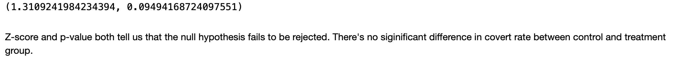

# A-B-Testing-for-website-conversion

For this project，we are looking at the result of A/B testing for an e-commerce website. The goal is to figure out if it is necessary for them to use the new website features or maintain the old one or extend the testing time before making the decision.

